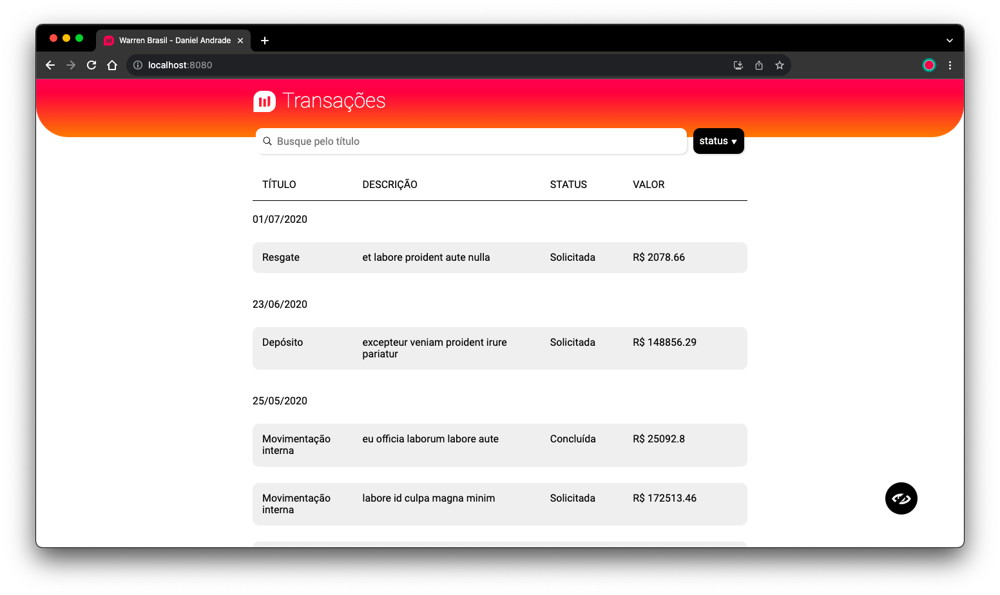

# Extrato de Movimentações

# Documentação 📑
Um guia rápido das minhas escolhas para o projeto!

## Escolha da Stack 📚
- Vue
- Typescript
- Less
- Axios
- Webpack
- Jest
- Cypress

À princípio me dediquei em seguir a proposta de stack utilizada pela equipe e mostrar meus conhecimentos para serem avaliados.

Pensei em agregar a lib de testes @vue/testing-library mas me atentei em realizar o desafio com o máximo de conhecimento possível para as ferramentas propostas.

## Arquitetura ⛺️
Separei os arquivos em pastas por contexto a partir da estrutura inicial que contém a pasta public com os arquivos de favicon e assets utilizados amplamente no suporte a PWA inclusive já no padrão disponível para ser fixado na tela inicial de qualquer sistema operacional com o ícone da warren estilizado, os arquivos de configurações das libs na raiz e a pasta tests somente para a realização de testes E2E (integração end to end) e dentro do source (src) na seguinte maneira:
- assets: pasta para os recursos interativos de mídia como ícones, imagens, áudios, vídeos e etc. separados por pastas para categoriza-los
- components: destinei aqui todos os componentes não definidos como página acessada via rota, também organizei de modo que cada componente pudesse ter sua própria pasta para que nela fossem adicionados os arquivos de teste, podendo termos uma melhor visualização dos componentes testados
- configs: contém a abstração do .env file
- mock: agrega de forma global mocks para request tests
- models: separa os arquivos de tipagem da api e do projeto, usando barrel files para fazer exports e agrupando os tipos do mesmo contexto em pastas
- router: reúne rotas e configurações da mesma, com ações a serem executadas a partir do acesso à URL
- services: contém os serviços de chamada da API e o serviço global de Modal
- store: padrão para modularização de estados e optei pela solução modular já que permite o crescimento do projeto e escalabilidade de arquivos com mais módulos de estado
- styles: os arquivos de estilo foram estruturados entre conceitos para uso de temas, constantes, mixins, e uso global de forma que possam ser acrescentado a funcionalidade de troca de tema
- utils: possui algumas funções de validações gerais compartilhadas entre componentes, serviços e actions
- views: pasta para agregar de forma estrutural os componentes acessados somente via rota
No demais, essa é a estrutura básica e conceito de uso da arquitetura, a estrutura dentro de src também possui alguns arquivos de configuração e declaração de tipos para o uso typescript.

## Nomenclaturaras 🖌
- CSS: Utilizei o modelo BEM (Block, Element, Modifier), seguindo sempre o nome do componente na frente do bloco principal, aproveitei também para adicionar sub blocos que pudessem ter seu próprio escopo, sempre pensando em no máximo 3 níveis de indentação no LESS
- Variáveis e atributos: padrão camelCase
- Componentes: padrão PascalCase
- Ícones: PascalCase e como forma de identificação adicionei o sufixo “Icon”
- Models: padrão de nomenclatura de arquivo kebab-case com nome das interfaces e tipos em PascalCase

## Requisitos & Soluções 🛠🔐
- Escalabilidade: A aplicação foi construída que a arquitetura possa ser escalável em questões de construção, podendo reaproveitar a estrutura disponível para novas implementações, como é o caso da overlay, da arquitetura de estilos para novos temas e etc.
- Responsividade: O projeto deve ser totalmente acessível oferecendo a melhor experiência possível para cada formato de tela, pensando nisso me permiti implementar para telas maiores uma visualização proveitosa do espaço disponível semelhante ha uma tabela, porém feita com display grid que possibilita no layout para telas de dispositivos mobile, apresentar o dado em card formats
- Cobertura de Tipos: Toda a aplicação utiliza a tipagem disponível do typescript, facilitando o debug e permitindo construções robustas, inclusive faz uso de tipos genéricos que deve ser utilizado com cuidado e moderação, mas atende bem componentes que precisam ser abstratos o suficiente como foi o caso da camada de overlay, que pode receber uma sidebar ou um camada de alerts customizados
- Acessibilidade: O app necessita ser acessível, ter marcação semântica das tags html, cores que destaquem os botões para permitir maior legibilidade, alto contraste para legibilidade da marca e indicar ao usuário os itens ativos e sugestivo para realizar as ações propostas
- Cobertura de testes por funcionalidade: A maior preocupação na criação dos testes foi com a cobertura por funcionalidade, não é incentivado ter o maior coverage, mas sim a maior eficiência e sempre cobrir TODOS os componentes e arquivos de manipulação
- Tratamento de erros: É necessário cuidar de avisar ao usuário quando erros nas requisições acontecerem, pensando nisso adicionei um tratamento no carregamento da lista de transações
- Experiência: Pensando em experiência da aplicação adicionei um  loading skeleton para proporcionar ao usuário uma espera de “percepção” de tempo reduzida e também como aviso de carregamento das informações; Por se tratar de uma aplicação financeira com dados sigilosos, inclui para o usuário um toggler para exibir ou não os valores dos valores das transações; Quando ha erro na requisição faço a sugestão de um refresh diretamente na aplicação, possibilitando uma possível solução
- Beleza: Uma aplicação necessita ter boa aparência principalmente p/ sistemas B2C onde o usuário final é também o cliente e se faz necessário utilizar das cores institucionais combinadas a referências de aplicações modernas que permita se comportar como uma PWA e SPA

## Tests 🧪
Para a realização de testes unitários utilizei o jest, sempre verificando a renderização do componente principal e adicionando validações de alteração do DOM, cada teste de componente consiste em manter as funcionalidades consistentes de forma unitária. Usei preferencialmente o método shallowMount pois conta com uma renderização simplificada e atende bem o objetivo de testar os componentes separadamente.

Para os testes de integração foi utilizado o Cypress, com o intuito de verificar alguns fluxos da aplicação mesmo.

Apesar de  não adicionar a lib de testes @vue/testing-library, utilizei um padrão de identificação incentivados pela equipe que a construiu sendo adicionado aos elementos verificados o atributo data-testid.

## Patterns 🎰

- Factory: Um pattern muito eficiente para solucionar casos como o de instâncias de necessidades diferentes, como seria o caso de diversos modais na aplicação onde é feito a estrutura principal se comunicar via service com a camada de renderização passando o componente que será utilizado dentro da estrutura principal. Utilizei p/ o Modal e para a camada de Overlay, sendo assim uma dupla abstração para futuros usos do Overlay
- Media Query Mixin’s: Para o uso do pré-processedor de forma mais eficiente utilizei um pattern de abstração de media query através de um mixin onde pôde-se criar pontos de quebra pré definidos e até mesmo customizados, permitindo ao html renderizado permanecer limpo e sem lista de classes extras no DOM para fazer uso de media query, possibilitando ao desenvolvedor a criação de uma experiência única para cada formato de tela
- EventBus: Para realizar a comunicação via eventos entre camadas e componentes diferentes da aplicação, como os serviços de Modal
- Object Literals: Para evitar o uso de processamento extra e ganho de performance, com menos switch cases e mais objetos, sendo a chave do objeto o caso corrente para o retorno de determinada ação. Utilizei nas factories de Modal e Overlay
- Object ApiUrls: Neste formato agrego todas os endpoints da aplicação em um único objeto, sendo de fácil acesso e uso, parametrizável e com a construção de query params
- RouterActions: As ações de rotas são disparadas via acesso da url com ganho de tempo p/ realizar as requisições em paralelo a construção dos objetos e permitindo independência do ciclo de vida do componente com o restante da regra de negócio

## EXTRAS 🚀
Incluí um módulo de svg, pois esta proposta de projeto usa o svg-loader do vue que permite ganho eficiente do uso de recursos p/ manipulação de ícones, temas, cores e etc.

Cuidei de adicionar animações nas transições p/ que fosse suave e interativo.

Observei o layout proposto e me permiti implementar com algumas sugestões de alteração, como a adição de filtros combinados que auxilia o usuário e o header de conteúdo dinâmico.
